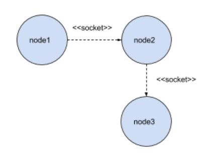

## Distributed Systems: Architectural Styles

#### Question 01 - Layered architectural style
Looking at the topology shown in the figure below, 



build the applications that can solve the following requirements:
- The application of `Node1` must generate two integers between 0 and 100 and send to the application of "node3" through `Node2`;
- `Node2` must resolve to receive the message sent by `Node1` and send to - "node3" only when the two numbers are different;
- If the two numbers sent by `Node1` are the same, `Node2` must respond to `Node1` with the value `0`;
- `Node3` must use the equation below to answer the requests that are made to it:
```math #yourmathlabel
 f(x,y) = y^y + x^x
```

##### Execution: 
- 1 - Run the `Node2` class: it waits for the receipt of` Node1`, and sends it to `Node3`;

- 2 - Run the `Node3` class: wait for` Node1` to send the message to `Node2`;

- 3 - Run the `Node1` class, randon 2 numers, send to `Node2` and get the values of` Node2` that does the calculation, and print on the screen.

___


#### Question 02 - Object-Based Architectural Style
Consider the scenario where a client application has knowledge of where there are three other nodes, two of which are the same (replicas) and that when needing to perform a request for any one of the nodes, if it does not succeed, it will try another one ( not reply). Implement this scenario from the schematic below.


Obs.:
 - follow the topology above;
 - adopt socket;

 ##### Execution: 
 
 ___