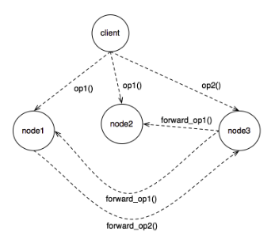
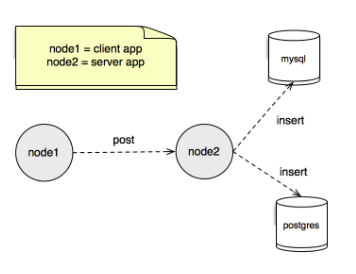

## Distributed Systems: Architectural Styles

#### Question 01 - Layered architectural style
Looking at the topology shown in the figure below, 


build the applications that can solve the following requirements:
- The application of `Node1` must generate two integers between 0 and 100 and send to the application of "node3" through `Node2`;
- `Node2` must resolve to receive the message sent by `Node1` and send to - "node3" only when the two numbers are different;
- If the two numbers sent by `Node1` are the same, `Node2` must respond to `Node1` with the value `0`;
- `Node3` must use the equation below to answer the requests that are made to it:
```math #yourmathlabel
 f(x,y) = y^y + x^x
```

##### Execution: 
- 1 - Run the `Node2` class: it waits for the receipt of` Node1`, and sends it to `Node3`;

- 2 - Run the `Node3` class: wait for` Node1` to send the message to `Node2`;

- 3 - Run the `Node1` class, randon 2 numers, send to `Node2` and get the values of` Node2` that does the calculation, and print on the screen.

___


#### Question 02 - Object-Based Architectural Style
Consider the scenario where a client application has knowledge of where there are three other nodes, two of which are the same (replicas) and that when needing to perform a request for any one of the nodes, if it does not succeed, it will try another one (not reply). Implement this scenario from the schematic below.



##### Obs.:
 - follow the topology above;
 - adopt socket;

 ##### Execution: 
 - 1 - Run the `Node1` project;

- 2 - Run the `Node2` project;

- 3 - See results on shell after run `Cliente` project.
 ___

#### Question 04 - Layered Architectural Style
Implement a simple data replicator that ensures data consistency. Adopt the distributed system topology next to it and test as instructed below.
(Use socket for communication between nodes.)



##### Obs.:
 - follow the topology above;
 - adopt socket;

##### Additional information:
| Table         | Field                      | Database   |
| ------------- |:--------------------------:| ----------:|
| tb_user       | code int, name varchar(50) | Mysql / Postgres |

##### Tests:
| Load          | Procedure                   | Results   |
| ------------- |:--------------------------| :----------:|
| 100 Users     | Send 100 user data insertion requests and report total time (in seconds) | 16 seconds|
| 1000 Users     | Send 1000 user data insertion requests and report total time (in seconds) | 261 seconds|
| 1000 Users     | By adopting threads, implement a solution that reduces the insertion time from 1000 requests and report the total time (in seconds) | 1 second |

##### Requirements: 
 - 1 - Install `docker`, guide [here](https://docs.docker.com/compose/install/).
 - 2 - Install `docker-compose`, guide [here](https://docs.docker.com/install/).

##### Execution: 
 - 1 - Open `Docker` folder (with bash), and run the command `docker-composer up` on some folder as `docker-compose.yml` file, and wait the database starts (MySQL and PostgreSQL);

- 2 - Run the `Node2` project;

- 3 - Run the `Node1` project;

- 4 - See results on shell of `Node1`.
 ___